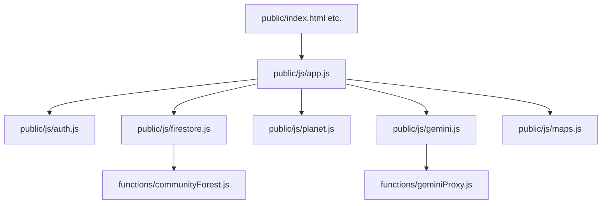

# Carbon Mirror - AI Agent Development Guidelines

Welcome, future Antigravity agent! This repository is built as a highly structured, hackathon-grade codebase evaluated on code quality, security, efficiency, testability, accessibility, and alignment.

Please adhere strictly to the following conventions during your session:

## Code Quality and Design Standards

- **Strict Mode:** Every JS file (both client and server) must begin with `'use strict';`.
- **ES Modules:** Use native ES Modules (`import`/`export`). Do not mix with CommonJS.
- **Documentation:** Every function must have clear JSDoc comments defining `@param`, `@returns`, and `@throws`.
- **Length Constraints:**
  - **Maximum Function Length:** 30 lines. If a function exceeds this, extract sub-helpers.
  - **Maximum File Length:** 200 lines. If a file exceeds this, split it into smaller modules.
- **Magic Numbers:** No magic numbers. Define and export all physical coefficients, math scale factors, and state constants in `public/js/constants.js`.
- **Production Logging:** Zero `console.log` statements in client-side production code. Import and use the structured `logger` from `public/js/utils.js` (which supports `.info`, `.warn`, and `.error`).

## Module Boundaries

- **Functional Purity:** Keep `public/js/carbon.js` entirely composed of pure, side-effect-free functions. This facilitates robust testing.
- **CSS Architecture:** The styling is pure Vanilla CSS3. Do not introduce tailwind compilation pipelines. Write component classes in `public/css/components.css` and map them to variables in `public/css/tokens.css`.

## Security and Error Handling

- **Credential Separation:** Never store, hardcode, or log API keys or secrets in the client-side files or Firestore records.
  - The client calls Google Maps via standard API injection but restricts credentials at the provider console.
  - The client interacts with the Gemini API exclusively via the server-side Cloud Function proxy (`functions/geminiProxy.js`).
- **Input Sanitization:** Sanitize all dynamic string values retrieved from users or API endpoints before rendering to the DOM using `sanitizeHTML` from `public/js/utils.js`.
- **Structured Error Handling:**
  - Wrap all asynchronous requests and effects in `try/catch` blocks.
  - Log failures with `logger.error` indicating failure metadata (e.g. error codes).
  - Throw typed, descriptive error objects back to the caller to fail gracefully.

## Testing Strategy

- **Test Suite:** We use **Jest** for unit testing.
- **Location:** Unit tests are located in `tests/unit/`.
- **Execution:** Run `npm run test` (which executes using Jest's experimental ESM VM support).
- **Target:** 100% of mathematical formulas and formatting functions in `carbon.js` and `utils.js` must be fully covered by unit tests.
