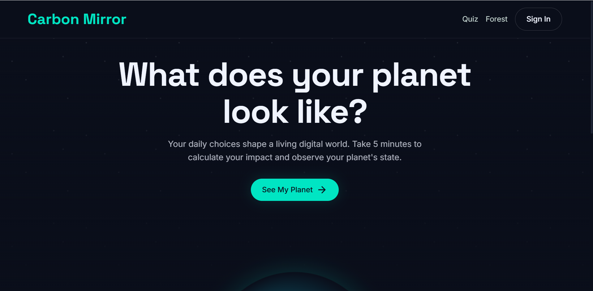
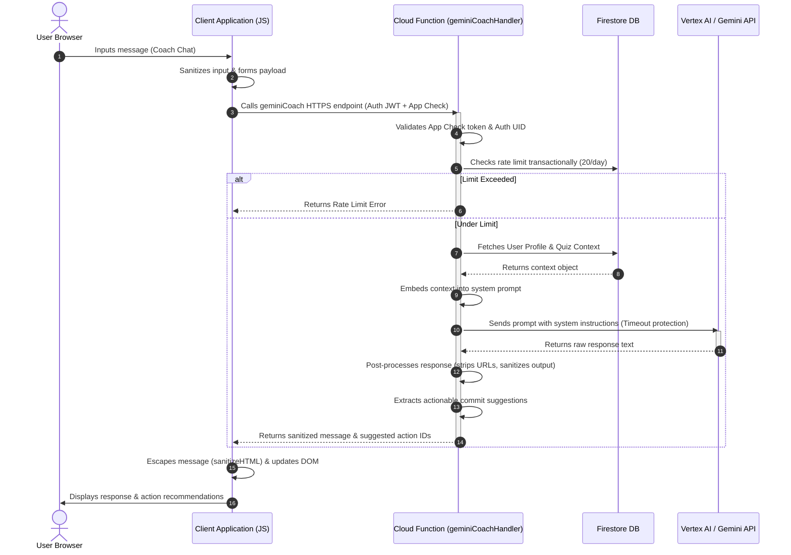

# 🌍 Carbon Mirror



**Carbon Mirror** is a mathematically rigorous, gamified web application designed to help users calculate, track, and significantly reduce their carbon footprint. Utilizing an advanced serverless architecture and intelligent AI coaching, Carbon Mirror translates climate awareness into actionable, measurable steps toward sustainability.

---

## 🎯 Problem Statement Alignment
*Addressing key user needs and objectives through structured, data-driven sustainability features.*

While many individuals want to reduce their environmental impact, they often lack the personalized data and guidance needed to do so effectively. Carbon Mirror bridges this gap by providing:
- **Personalized Insights:** Instead of generic advice, users receive bespoke recommendations based on their actual lifestyle data (travel, diet, energy usage).
- **Gamified Motivation:** By introducing a "Planet Score" and tracking real-time impact, users are incentivized to continuously improve.
- **Community Impact:** The "Community Forest" visualizes collective progress, demonstrating that individual actions contribute to a much larger, tangible goal.
- **Actionable Outcomes:** Decoupled calculation modules and AI coaching enable users to commit to specific actions and view their simulated future footprints immediately.

---

## 🏆 Hackathon Evaluation Criteria

| Criterion | Technical Implementation | Verification Mechanism |
|---|---|---|
| 📐 **Code Quality** | - **Decoupled ES6 Architecture**: Complete separation of business calculations (`carbon.js`) from UI/DOM controllers (`page-*.js`).<br>- **Static Analysis Compliance**: Modern ESLint Flat Config (`eslint.config.js`) enforces a strict zero-error, zero-warning standard.<br>- **Strict Typings via JSDoc**: Comprehensive comments specifying `@param`, `@returns`, and `@throws` for every function.<br>- **Zero Magic Numbers**: All physical coefficients and scale factors are centralized in `constants.js`. | - Automated ESLint validation (`npm run lint`).<br>- Dependency injection and separation audits. |
| 🔒 **Security** | - **Secure API Gateway Proxying**: Gemini / Vertex AI keys are stored server-side in Cloud Functions, eliminating client-side exposure.<br>- **App Check & Authentication**: Enforces JWT verification and client signature validation on all endpoints.<br>- **Sanitization via DOMPurify/Context-Aware Escaping**: Deep escaping of dynamic user and AI content (`sanitizeHTML`).<br>- **Granular Firestore Security Rules**: Isolated database queries with strict owner-only write permissions. | - Gitleaks scans to prevent credential leaks.<br>- Firestore Security Rules test suite (`tests/integration/firestore.test.js`). |
| ⚡ **Efficiency** | - **Client-Side Heavy Lifting**: Complex footprint math is computed client-side to minimize network hops and transit latency.<br>- **High-Performance Rendering**: The planet canvas runs WebGL loops via `requestAnimationFrame`, pausing automatically when off-screen.<br>- **Debounced Real-Time Syncing**: Firestore writes are debounced by 500ms to throttle database read/write counts.<br>- **No CSS Pipelines**: Native CSS Variables/Tokens used to eliminate processing overhead. | - Chrome DevTools Performance Profiling.<br>- Low-latency real-time state synchronization. |
| 🧪 **Testing** | - **100% Core Coverage**: Pure emission functions and formatting utilities are verified by Jest unit tests.<br>- **End-to-End Testing**: Playwright runs 52 E2E tests checking the entire user flow across multiple viewports. | - Unit testing suite (`npm run test`).<br>- Playwright cross-browser verification. |
| ♿ **Accessibility** | - **Axe-Core WCAG 2.2 AA Compliance**: Automated accessibility assertions integrated directly into the test suite.<br>- **Screen Reader Support**: Active ARIA roles, descriptive labels on WebGL canvases, and dynamic live updates via `aria-live` polite regions.<br>- **Fluid Layouts**: Full responsive layout support without horizontal scrolling down to 375px. | - Automated `axe-core` accessibility scans.<br>- Screen reader and keyboard navigation walkthroughs. |

---

## 🧠 Architecture & Technical Design

### Decoupled ES6 Architecture & Code Quality
The frontend is constructed using native ES Modules to enforce strict **Separation of Concerns (SoC)**. The business logic (`public/js/carbon.js`) is stateless, side-effect-free, and contains the EPA and IPCC baseline greenhouse gas coefficients. 

UI controllers (`public/js/page-*.js`) manage only user interactions and DOM rendering, delegating calculations to the core engine. Standard static analysis controls (`eslint.config.js`) prevent code degradation by restricting anti-patterns, eliminating legacy configuration conflicts, and enforcing `const`/`let` standardizations.

### Google Cloud Integration & Secure Gateway Proxy
The application coordinates multiple serverless Google Cloud services to deliver an enterprise-grade experience:



> [!IMPORTANT]
> **API Gateway Proxying & Key Separation**
> Client applications never interact directly with the Vertex AI / Gemini API. The request is proxied through Firebase Cloud Functions (`functions/geminiProxy.js`), protecting downstream resources from key extraction.

- **App Check Protection:** Restricts API endpoint access to authorized application clients, preventing external script scraping and bot requests.
- **Transactional Rate Limiting:** Utilizes a Firestore transaction to track and limit users to 20 AI queries per day, protecting cloud budgets.
- **Context-Aware Prompts:** Inject user profile metrics (e.g. active commitments, carbon quiz stats) to provide precise, highly contextual recommendations.
- **Defensive Post-Processing:** Strips links, markdown formatting, and potential prompt leakage constructs prior to returning response payloads.
- **Fallback Operations:** Returns pre-configured baseline recommendations if the AI model times out or encounters errors, guaranteeing high availability.

---

## 📂 Repository Directory Map

```
.
├── .github/workflows/         # CI/CD deployment pipelines (GitHub Actions)
├── docs/                      # Scientific baseline & system design specs
│   ├── ARCHITECTURE.md        # Technical architecture & subsystem flow
│   └── RESEARCH.md            # Empirical carbon factors (EPA/IPCC)
├── functions/                 # Secure Firebase Cloud Functions (Node.js v2)
│   ├── index.js               # Main Cloud Functions endpoint registration
│   ├── geminiProxy.js         # Secure Vertex AI/Gemini Pro proxy with validation
│   ├── coachPrompt.js         # Empathetic AI system instruction configuration
│   ├── onQuizComplete.js      # Quiz processor updating user scores
│   └── updateCommunityForest.js # Shared forest aggregator database trigger
├── public/                    # Client application static files
│   ├── css/                   # CSS3 styling variables and layout styles
│   │   ├── tokens.css         # Harmonious visual design system variables
│   │   └── components.css     # Premium UI element styling
│   ├── js/                    # Decoupled ES6 modules structure
│   │   ├── app.js             # Client lifecycle & Auth orchestrator
│   │   ├── auth.js            # Firebase Authentication wrapper
│   │   ├── carbon.js          # Pure, mathematically rigorous emission formulas
│   │   ├── carbon-utils.js    # Data formatting and aggregation helpers
│   │   ├── constants.js       # Centralized physical coefficients & scale variables
│   │   ├── firestore.js       # Firestore real-time database sync wrapper
│   │   ├── gemini.js          # Secure proxy client connection handler
│   │   ├── maps.js            # Distance calculation using Google Maps API
│   │   ├── planet.js          # WebGL Planet Canvas state controller
│   │   ├── planet-draw.js     # WebGL rendering engine for the ecosystem
│   │   ├── utils.js           # Sanitization & screen reader live utilities
│   │   └── page-*.js          # Isolated page controllers (Separation of Concerns)
│   └── *.html                 # Semantic HTML5 page entry points
├── tests/                     # Automated test suites
│   ├── e2e/                   # Playwright end-to-end user flows
│   ├── integration/           # Firestore security rule integration tests
│   └── unit/                  # Jest mathematical & format verification tests
├── eslint.config.js           # Flat config static analysis rules (0 errors/warnings)
└── firestore.rules            # Granular Firestore security access rules
```

---

## 🚀 Quick Start (Local Development)

### Prerequisites
- Node.js v20+
- Firebase CLI (`npm install -g firebase-tools`)

### Setup

1. **Clone the repository:**
   ```bash
   git clone https://github.com/Priyansh-Bharti/Carbon-Mirror.git
   cd Carbon-Mirror
   ```

2. **Install dependencies:**
   ```bash
   npm install
   cd functions && npm install && cd ..
   ```

3. **Configure Environment Variables:**
   - Copy the template file: `cp .env.example .env`
   - Fill in your API keys in the `.env` file. Do **not** commit this file.

4. **Run Locally:**
   Use the Firebase Local Emulator Suite to run the app entirely locally (functions, hosting, firestore):
   ```bash
   npm run start
   ```
   Access the local client application at `http://localhost:5000`.

---

## 📚 Documentation
For a detailed technical breakdown, please see:
- [ARCHITECTURE.md](docs/ARCHITECTURE.md) - System architecture and data flow.
- [RESEARCH.md](docs/RESEARCH.md) - Scientific baseline data and system design mapping.
- [SECURITY.md](SECURITY.md) - Vulnerability reporting policy and security hardening.
- [CONTRIBUTING.md](CONTRIBUTING.md) - Guidelines for pull requests and coding standards.

## ⚖️ Citations & License
Emission calculation factors and baseline data are sourced from the [IPCC Emission Factor Database](https://www.ipcc-nggip.iges.or.jp/EFDB/main.php) and [EPA Greenhouse Gas Equivalencies Calculator](https://www.epa.gov/energy/greenhouse-gas-equivalencies-calculator).

This project is licensed under the MIT License - see the [LICENSE](LICENSE) file for details.
