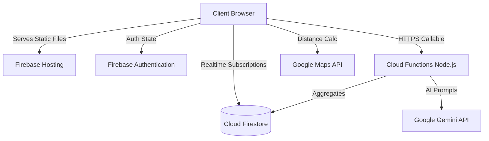

# Architecture Overview

Carbon Mirror is built on a modern, serverless architecture focusing on performance, security, and developer velocity. This document outlines the structural choices and data flows.

## System Diagram

## Frontend Architecture
The frontend is a lightweight Single Page Application (SPA) utilizing ES Modules without a complex build step like Webpack or Vite.
- **`public/index.html`**: Entry point and global layout shell.
- **`public/js/app.js`**: Core router and Firebase initialization logic.
- **`public/js/carbon.js`**: Pure functional math module for emission calculations. 100% test coverage.
- **CSS Architecture**: Vanilla CSS using custom properties (`tokens.css`) and component-based structure (`components.css`).

## Backend Architecture
- **Cloud Firestore**: Acts as the single source of truth. Security rules enforce that users can only read/write their own document data. A global `community` document stores aggregate statistics.
- **Cloud Functions**:
  - `geminiCoachHandler`: A proxy that protects the Gemini API key, handles sanitization, and rate-limiting.
  - `updateCommunityForestHandler`: Triggered defensively to update global statistics when user actions are taken.

## CI/CD Pipeline
Deployed via GitHub Actions:
1. **CI**: Lints, Tests, and checks for leaked secrets (`gitleaks`).
2. **Deploy Preview**: Spins up temporary Firebase environments on PR creation.
3. **Deploy Production**: Deploys securely to the `live` channel upon merging to `main`.
